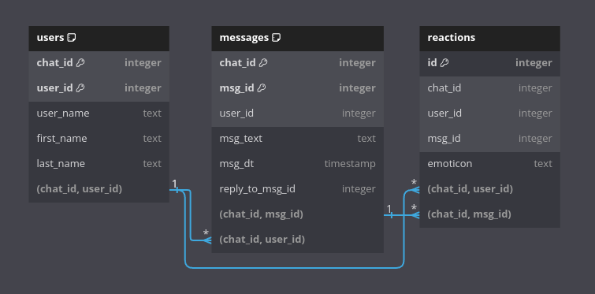

# Telegram Group Message Exporter

This project provides a way to export messages and users from a Telegram group and store them in a database. The exported data can be further analyzed and visualized for various purposes.

## Getting Started

Follow the steps below to set up the environment and run the export process.

### Installation

1. **Create a virtual environment**:

    ```bash
    python3 -m venv venv
    ```

2. **Activate the virtual environment**:

    ```bash
    source venv/bin/activate
    ```

3. **Install the required dependencies**:

    ```bash
    pip install -r requirements.txt
    ```

### Running the Export

1. **Export messages from Telegram**:

    Run the following command to start the export process:

    ```bash
    bash ./scripts/export.sh
    ```

### Script Details

The `export.sh` script performs the following steps:

1. **Set the PYTHONPATH**: It sets the Python path to the current working directory.

2. **Database Initialization**: If the database already exists and the `DROP_DB_IF_EXISTS` parameter is set to `True`, the database will be dropped and reinitialized. If the parameter is `False`, the script will stop execution.

3. **Telegram API Parameters**:
    - `API_ID`, `API_HASH`, and `CHAT_ID` are required to interact with the Telegram API.
    - `SESSION_NAME` is used to save the session file for authentication.

4. **Pickle Files**:
    - If `SAVE_PICKLE` is set to `True`, messages and users will be saved as pickle files.
    - If `MSG_PKL_FILE` and `USR_PKL_FILE` are non-empty, the data will be loaded from these files instead of directly exporting from Telegram.

    The objects stored in the pickle files are instances of classes defined in `src/models.py`. These classes represent the structure of the messages, reactions and users as they are stored in the database.

5. **Data Export**: The script will run the `export.py` script to export Telegram messages and store them in the database.

### Configuration

Before running the `export.sh` script, make sure to set the following parameters:

- `API_ID`: Your Telegram API ID.
- `API_HASH`: Your Telegram API hash.
- `CHAT_ID`: The ID of the Telegram chat you want to export messages from.
- `SESSION_NAME`: A name for the session file.
- `SAVE_PICKLE`: Set to `True` if you want to save messages and users to pickle files.
- `MSG_PKL_FILE`: Path to the message pickle file (optional).
- `USR_PKL_FILE`: Path to the user pickle file (optional).

### Database Table Structures
The exported data are stored in an SQLite database located in the `db` directory. This database is created and managed by the `export.sh` script during the export process.

The structure of the database tables used in this project can be viewed at the following [link](https://dbdiagram.io/d/66a0eb2c8b4bb5230e38e728)



### License

This project is licensed under the MIT License - see the LICENSE file for details.
